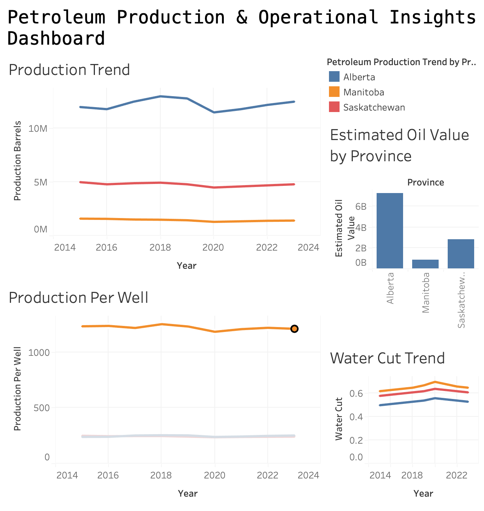

# Petroleum Data Pipeline & Dashboard

## Overview
This project demonstrates an end-to-end ETL pipeline built using Python to process and analyze petroleum production data.

## Tools Used
- Python (Pandas)
- SQLite (database)
- Tableau (data visualization)

## Pipeline Architecture
Extract → Transform → Validate → Load → Dashboard

## Features
- Data extraction from structured dataset
- Data cleaning and transformation (ETL)
- Data validation checks for quality assurance
- Data storage in SQLite database
- Summary report generation
- Tableau dashboard for visualization

## Dashboard



## Key Insights
- Alberta has the highest production levels across all years
- Production efficiency varies by province
- Oil price significantly impacts total value
- Water cut trends indicate operational efficiency differences

## How to Run

```bash
python3 scripts/run_pipeline.py


